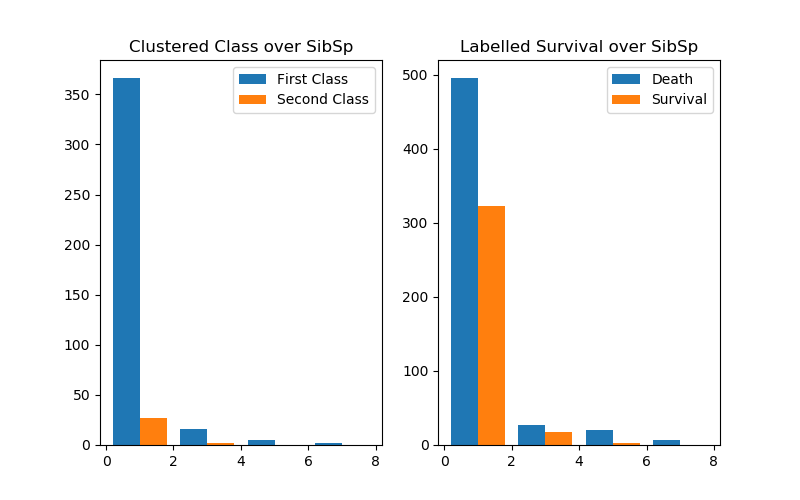
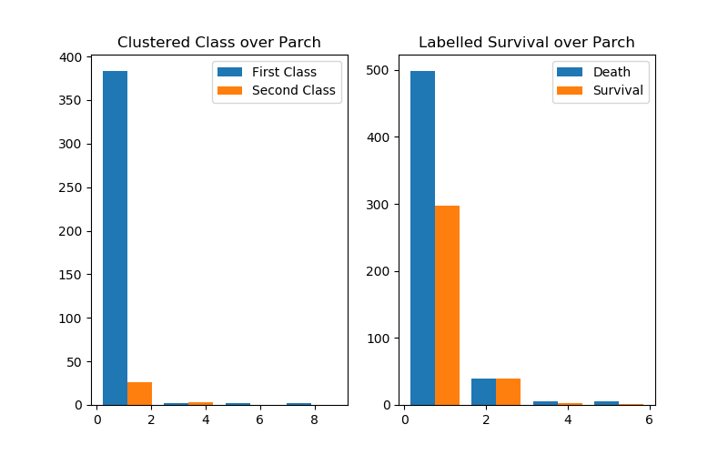
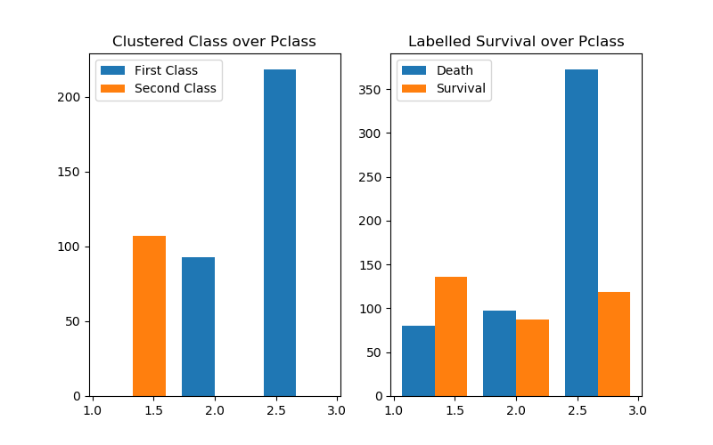
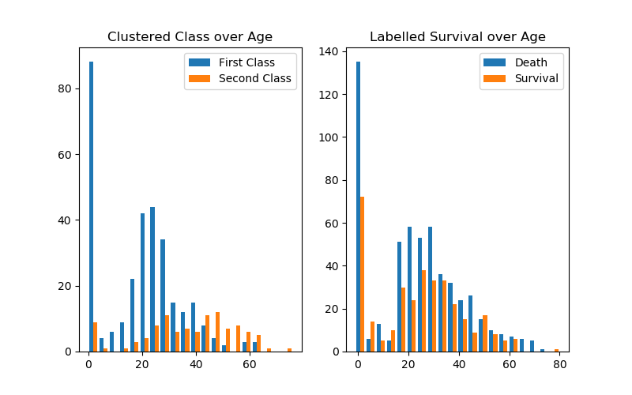
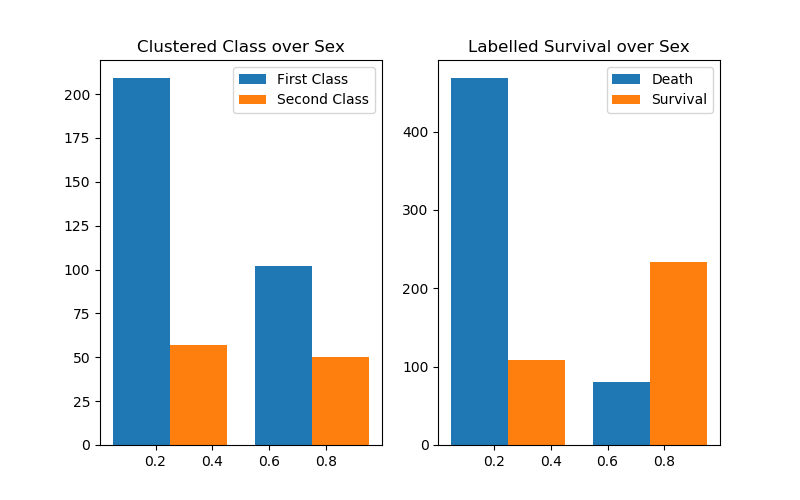
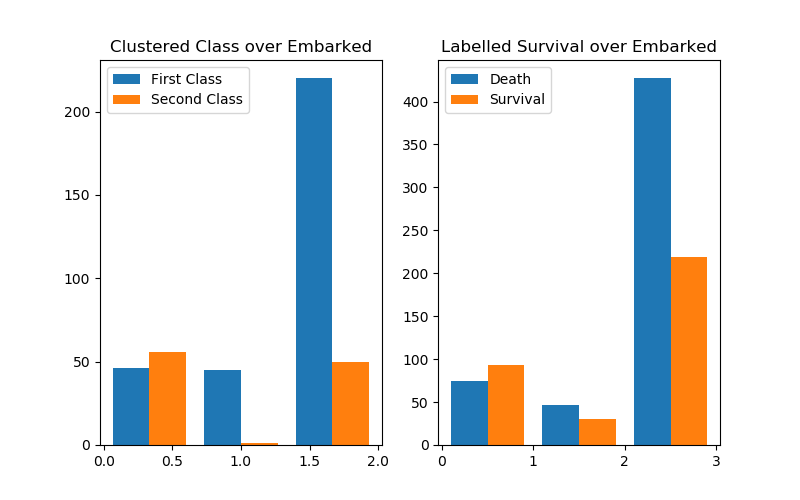
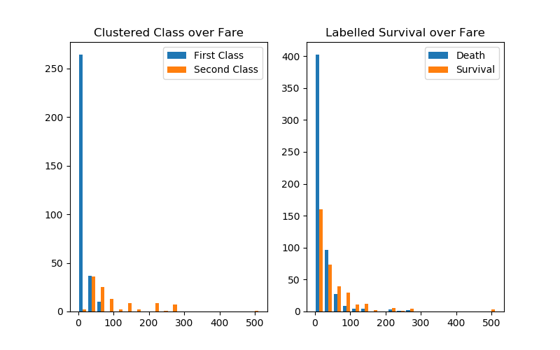
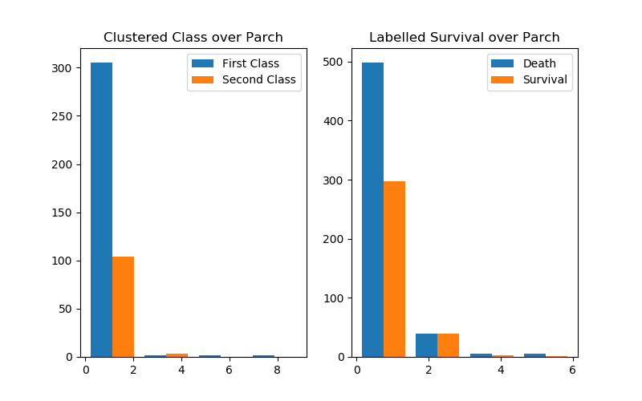
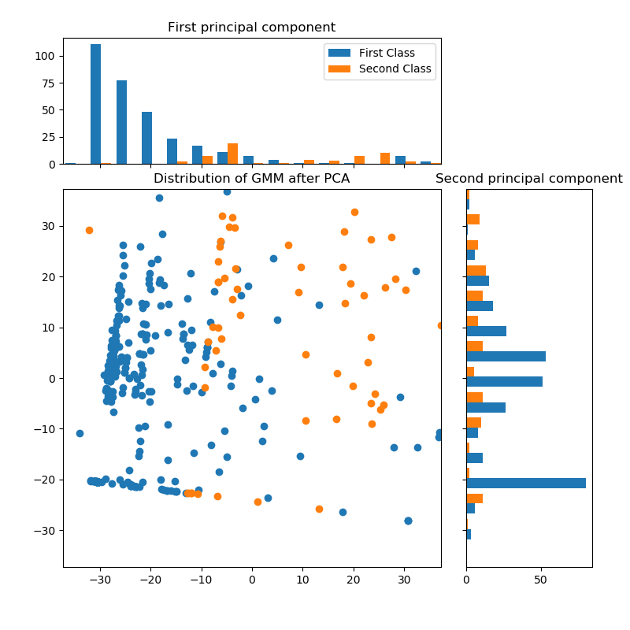
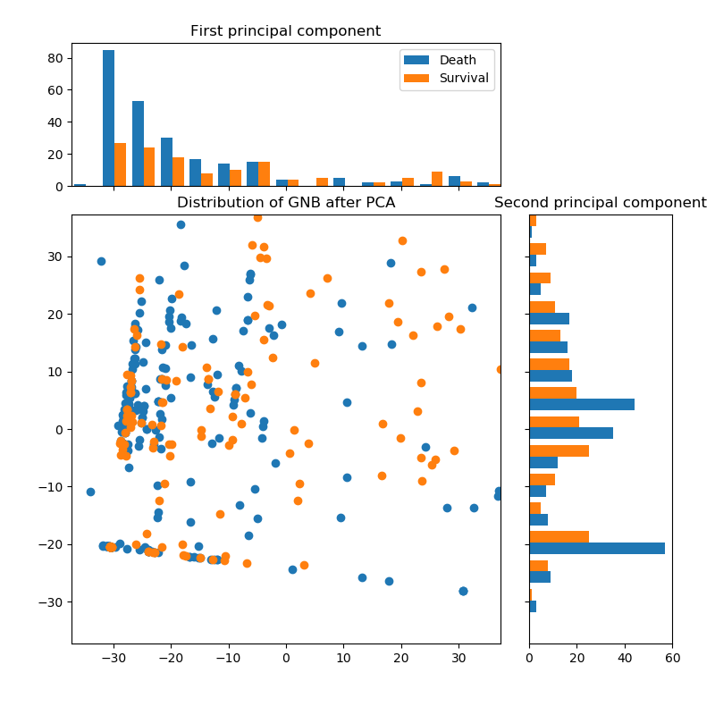

# 作业三：分类与聚类

## 汇报人
- 汪汗青 2120171064

## 环境依赖
- python3.5
- numpy
- sklearn
- matplotlib

## 目录
1. [数据说明](#数据说明)
2. [数据预处理](#数据预处理)
3. [分类模型挖掘](#分类模型挖掘)
    - [Gaussian Naive Bayes](#GaussianNaiveBayes)
    - [SVM](#SVM)
    - [分类结果可视化与分析](#分类结果可视化与分析)
4. [聚类模型挖掘](#聚类模型挖掘)
    - [KMeans](#KMeans)
    - [GMM](#GMM)
    - [聚类结果可视化及分析](#聚类结果可视化及分析)

## 数据说明

本实践使用的数据集为Titanic: Machine Learning from Disaster数据集，该数据集记录了Titanic号海难的部分船员信息。该数据集分为两个部分，`training set`和`testing set`。其中`test.csv`包含418个数据条目，11个属性。`training.csv`,包含891个数据条目，12个属性，比`testing`数据集多一个`Survival`属性，表示该船员是否幸存。数据的各项属性描述如下:

<table>
<tbody>
<tr><th><b>Variable</b></th><th><b>Definition</b></th><th><b>Key</b></th></tr>
<tr>
<td>survival</td>
<td>Survival</td>
<td>0 = No, 1 = Yes</td>
</tr>
<tr>
<td>pclass</td>
<td>Ticket class</td>
<td>1 = 1st, 2 = 2nd, 3 = 3rd</td>
</tr>
<tr>
<td>sex</td>
<td>Sex</td>
<td></td>
</tr>
<tr>
<td>Age</td>
<td>Age in years</td>
<td></td>
</tr>
<tr>
<td>sibsp</td>
<td># of siblings / spouses aboard the Titanic</td>
<td></td>
</tr>
<tr>
<td>parch</td>
<td># of parents / children aboard the Titanic</td>
<td></td>
</tr>
<tr>
<td>ticket</td>
<td>Ticket number</td>
<td></td>
</tr>
<tr>
<td>fare</td>
<td>Passenger fare</td>
<td></td>
</tr>
<tr>
<td>cabin</td>
<td>Cabin number</td>
<td></td>
</tr>
<tr>
<td>embarked</td>
<td>Port of Embarkation</td>
<td>C = Cherbourg, Q = Queenstown, S = Southampton</td>
</tr>
</tbody>
</table>

## 数据预处理

为了方便对数据进行分类和聚类的挖掘，我选取了以下的一些属性。

1. pclass
2. sex
3. Age
4. bibsp
5. parch
6. fare
7. embarked

对于数据中部分的缺失项，我首先对它们进行了分析，发现缺失项主要出现在Age和embarked两个属性上。对于第一个Age属性的缺失，为了防止填充过程对总的数据分布的影响，我采用填0的方式。对于第二个属性，由于其是标称属性，我对其增加了一个标签值NA来填补缺失项。

## 分类模型挖掘

在分类模型挖掘这一部分，我采用了两种不同的有监督的分类算法进行分类。一种是基于高斯模型的朴素贝叶斯分类器，第二种是高斯核的支持向量机分类。我们的分类任务是将筛选出的7个属性作为特征进行输入，对其是否幸存进行预测。

### Gaussian Naive Bayes

高斯朴素贝叶斯(Gaussian Naive Bayes)分类器是采用高斯模型对似然进行建模的朴素贝叶斯方法。有关算法的详细介绍可见[https://en.wikipedia.org/wiki/Naive_Bayes_classifier#Gaussian_naive_Bayes](https://en.wikipedia.org/wiki/Naive_Bayes_classifier#Gaussian_naive_Bayes)。这里使用`sklearn.naive_bayes`的`GaussianNB`模块实现。

### SVM

SVM(Support Vector Machine)分类器是一个经典有效的有监督分类模型，采用核方法后的SVM具有更好的分类能力。算法的详细介绍可见[https://en.wikipedia.org/wiki/Support_vector_machine](https://en.wikipedia.org/wiki/Support_vector_machine)。这里使用`sklearn`的`svm`模块训练了一个高斯核的支持向量机。

### 分类结果可视化与分析

为了分析各个属性值对分类结果的影响，我们对每一个属性的分类结果分别绘制了直方图。由于我们不知道测试数据中的标签的真实值，因而我还绘制了训练数据中的直方图与测试数据结果进行对比，看两个数据的预测分布是否相似。

#### Gaussian Naive Bayes 分类结果

#### SVM 分类结果

#### 结果分析

首先，我们对有标签的训练数据进行总结。

从绘制的图像中，我们可以逐个分析每个属性对船员是否幸存的影响。
1. **Pclass**. Pclass属性是乘员购买的传票的等级，分为三个等级。从图中我们可以看出，大多数的船员购买的都是三级船票，这一部分的遇难人数也是最多的，相较之下，购买二级船票和一级船票的船员生存率更高，购买一等船票的幸存者人数甚至高于三级船票的人数。
2. **Age**. Age属性表示的是乘员的年龄，由于存在部分的缺失值用0填补，且0-5岁的船员本身数量很少，因而我们可以忽略掉0附近的条块。可以看出，各个年龄段的幸存率基本在50%左右，而18-45和65-70岁之间的船员死亡率都大大高于生存率，推测这与当时让幼弱优先登上救生筏的号召相关。
3. **Sex**. Sex表示的是乘员的性别。显然女性的生存率大大高于男性。推测这与当时让妇女优先登上救生筏的号召相关。
4. **SibSp**. SibSp表示乘员登船手足(兄弟姐妹)的数量。该属性的分布由于bias比较严重，部分标签数据太少不具有统计学意义，因而不能推测相关性。
5. **Parch**. Parch表示乘员登船的父母和子女的数量。与上个属性类似，部分标签数据太少不具有统计学意义，因而不能推测相关性。
6. **Embarked**. Embarked属性表示船员登船的位置。Titanic沿途经过了三个登船点。其中从Cherbourg登船的乘客存活率最高，从Southampton登船的存活率最低。
7. **Fare**. Fare属性表示船员购买船票的价格。显然，船员的生存率随着传票价格的增长而大大提高。可以结合**Pclass**属性看出，在这次海难中遇难的大多数都是比较贫穷的人。

接下来我们分析分类模型的预测结果。由于缺乏测试数据集的标签，我们判断分类器在测试集上分类效果的好坏是基于测试集和训练集同分布的假设的。基于这样的假设，如果预测结果的标签和训练数据的标签分布接近，则说明效果较好，如果差异较大，则说明效果不好。从图中的结果来看，两个模型的预测效果略有差别，尤其是在性别(Sex)维度上，相较来说，Gaussian Naive Bayes预测结果更符合原始分布规律，分类效果更好。

## 聚类模型挖掘

在聚类模型挖掘这一部分，我采用了两种不同的无监督的分类算法进行分类。一种是K-Means算法，第二种是GMM混合高斯模型。我们的聚类任务是将筛选出的7个属性作为特征进行输入，对其进行无监督聚类。接下来我将先简单介绍所用的聚类算法，并对聚类结果进行可视化和分析。

### KMeans
K-means算法是一种经典的聚类算法，通过不断迭代更新类中心点直到达到终止条件为止，距离聚类中心近的样本点被分为该类。有关算法的详细介绍参见[https://en.wikipedia.org/wiki/K-means_clustering](https://en.wikipedia.org/wiki/K-means_clustering)。这里使用`sklearn.cluster`的`KMeans`模块来实现Kmeans聚类。

### GMM
GMM是Gaussian Mixture Model的缩写，是一种混合模型。它是一种基于模型的聚类方法，会对每一个类建立分布模型从而估计样本点属于该类的概率。有关算法的详细介绍参见[https://en.wikipedia.org/wiki/Mixture_model#Gaussian_mixture_model](https://en.wikipedia.org/wiki/Mixture_model#Gaussian_mixture_model)。这里使用`sklearn.mixture`的`GMM`模块来实现GMM聚类。

### 聚类结果可视化及分析

在这里我们采用PCA提取特征的主成分来对聚类结果进行可视化。并和分类的结果进行对比。可视化如下所示。

#### K-means 聚类结果

#### GMM 聚类结果

#### 低维可视化

<table>
<tr>
<th></th>
<th></th>
</tr>
</table>
<table>
<tr>
<th></th>
<th></th>
</tr>
</table>

#### 结果分析

由于PCA高维属性在主成分方向的投影，它只倾向于将数据打散，而不含任何的监督信息。在一定程度上用来降维可视化有监督分类和无监督聚类是公平的。 

从图中可以看出，在二维主成分空间中，不论是对聚类结果还是分类结果，两个类都无法进行很好的区分。但是GMM聚类的结果比Kmeans的结果要好一些，Kmeans聚得的第二个类数量很少。

将上面的聚类结果和下面的分类结果进行对比，可以发现聚类结果和分类结果还是有所区别的。从单个维度上分析，可以看出GMM聚类倾向于将样本点从Pclass属性上分开，而KMeans聚类效果不佳。